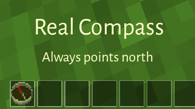

Real Compass
============

**compass** *(n)* A mechanical or electronic instrument used for navigation or orienteering,
which points to the physical or magnetic north pole.

This is a fork of compassgps (and compass), with 90% of the code removed.

David_G (kestral246@gmail.com)


Features
--------
This mod tries to address what the "real" essence of being a compass is all about.

No options, no gui's, just an animated needle that points toward the north.

The only other change that I made was, that since compasses are typically divided up in 1/4th, 
1/8th, and 1/16th divisions, I updated it to point in 16 directions rather than the original 12.





Crafting guide
--------------
Same crafting recipe as the other compass versions, so it's probably not compatible with them.

```
             , steel_ingot          ,
  steel_ingot, mese_crystal_fragment, steel_ingot
             , steel_ingot          ,
```


License
-------
- **textures:** original compass textures: CC BY-SA by Echo (45deg versions added by kestral246 also CC BY-SA) 
- **code:**  My changes to original code are CC0-1.0
- **original compassgps license:** Original code by Echo, PilzAdam, and TeTpaAka is WTFPL. Kilarin (Donald Hines) changes are CC0 (No rights reserved)


Thanks
------
This mod is basically compassgps with 90% of its code ripped out, so I can't take much credit.
That belongs to Echo, PilzAdams, TeTpaAka, and Kilarin.  I was just standing on their shoulders.

- [compassgps](https://github.com/Kilarin/compassgps) / Kilarin (Donald Hines),
et. al.

